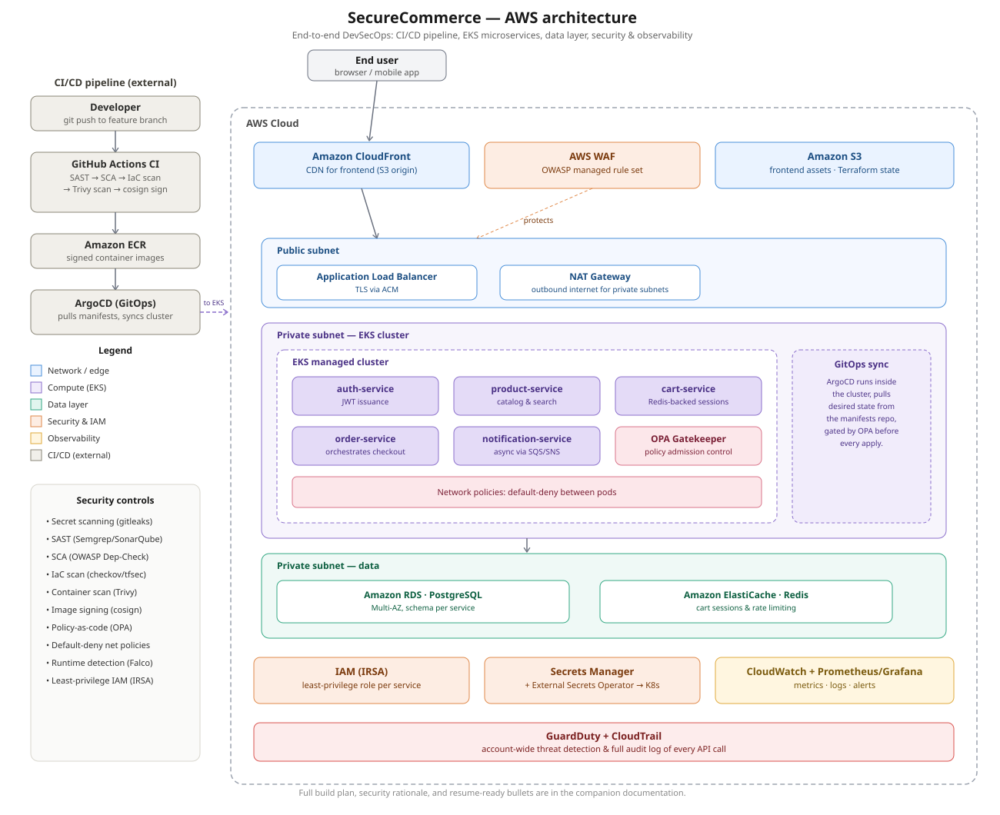

# SecureCommerce

**A cloud-native microservices e-commerce platform on AWS, built with a full DevSecOps pipeline.**

> MTech Cloud Computing capstone project — infrastructure as code, EKS microservices, automated security gates (SAST/SCA/IaC/container scanning), GitOps deployment, and observability.


-326CE5)


---

## What this is

SecureCommerce is a small e-commerce app (auth, product catalog, cart, orders, notifications) deployed as independent microservices on Amazon EKS. The application itself is intentionally simple — the point of the project is everything *around* it: infrastructure defined entirely as code, a CI/CD pipeline with real automated security gates at every stage, GitOps-based deployment, and a full observability stack.

This project is being built **incrementally, in phases**, alongside coursework — not all at once. The checklist below tracks real progress, not a planned-but-unbuilt roadmap. See [`docs/architecture.md`](docs/architecture.md) for the full design rationale and [`docs/SecureCommerce_Architecture_Diagram.svg`](docs/SecureCommerce_Architecture_Diagram.svg) for the architecture diagram.



---

## Build status

Legend: 🟩 Core (required for the project to "count") · 🟦 Stretch (added if time permits)

### Phase 1 — Foundation (Terraform / AWS)
- [ ] 🟩 VPC with public + private subnets across 2 AZs
- [ ] 🟩 EKS cluster provisioned via Terraform
- [ ] 🟩 ECR repositories
- [ ] 🟩 RDS PostgreSQL (Multi-AZ)
- [ ] 🟩 IAM roles with IRSA for service accounts
- [ ] 🟦 ElastiCache Redis
- [ ] 🟩 Remote Terraform state (S3 + DynamoDB lock)
- [ ] 🟩 `terraform destroy` verified — full teardown works cleanly

### Phase 2 — Application services
- [ ] 🟩 `auth-service` — signup, login, JWT issuance
- [ ] 🟩 `product-service` — catalog, search
- [ ] 🟩 `order-service` — checkout orchestration
- [ ] 🟦 `cart-service` — Redis-backed sessions
- [ ] 🟦 `notification-service` — async email/SMS via SQS/SNS
- [ ] 🟩 `frontend` — React/Next.js SPA on S3 + CloudFront
- [ ] 🟩 Services deployed manually to EKS once, confirmed working end to end

### Phase 3 — CI pipeline
- [ ] 🟩 GitHub Actions: unit tests
- [ ] 🟩 SAST (Semgrep or SonarQube)
- [ ] 🟩 SCA / dependency scan (OWASP Dependency-Check or Snyk)
- [ ] 🟩 IaC scan (checkov or tfsec)
- [ ] 🟩 Container image scan (Trivy)
- [ ] 🟩 Image signing (cosign)
- [ ] 🟩 Push signed image to ECR

### Phase 4 — GitOps CD + policy
- [ ] 🟩 ArgoCD installed on cluster
- [ ] 🟩 Separate manifests repo wired up
- [ ] 🟩 Deploy triggered purely by a Git commit (no manual `kubectl apply`)
- [ ] 🟦 OPA Gatekeeper policies enforced (no root containers, no `:latest` tags, resource limits required)

### Phase 5 — Runtime security
- [ ] 🟩 Kubernetes Network Policies (default-deny)
- [ ] 🟩 AWS Secrets Manager + External Secrets Operator
- [ ] 🟩 AWS WAF on the ALB
- [ ] 🟦 Falco runtime anomaly detection
- [ ] 🟦 GuardDuty + CloudTrail enabled

### Phase 6 — Observability
- [ ] 🟩 Prometheus + Grafana dashboards
- [ ] 🟩 Centralized logging (CloudWatch Logs or OpenSearch)
- [ ] 🟩 At least 3 alert rules, tested by deliberately breaking something

### Phase 7 — Validation & docs
- [ ] 🟦 Load test with k6 or Locust
- [ ] 🟦 Chaos test — kill a pod mid-traffic, confirm self-healing
- [ ] 🟩 Final architecture + security-controls documentation
- [ ] 🟩 Real cost figure recorded (not estimated)

> Update the checkboxes as each piece is actually deployed and verified — don't check something off until you've seen it work.

---

## Architecture

| Layer | Services |
|---|---|
| Edge | CloudFront, WAF, ALB |
| Compute | EKS — auth, product, cart, order, notification services |
| Data | RDS PostgreSQL (Multi-AZ), ElastiCache Redis |
| CI/CD | GitHub Actions → ECR → ArgoCD (GitOps) → EKS |
| Security | Semgrep, OWASP Dependency-Check, checkov/tfsec, Trivy, cosign, OPA Gatekeeper, Secrets Manager |
| Observability | Prometheus, Grafana, CloudWatch, GuardDuty, CloudTrail |

Full rationale for each control — what it catches and why it sits where it does in the pipeline — is in [`docs/architecture.md`](docs/architecture.md).

---

## Repository structure

```
securecommerce/
├── infra/                      # Terraform
│   ├── modules/
│   │   ├── vpc/
│   │   ├── eks/
│   │   ├── rds/
│   │   ├── ecr/
│   │   └── iam/
│   └── envs/
│       └── dev/
├── services/
│   ├── auth-service/
│   ├── product-service/
│   ├── cart-service/
│   ├── order-service/
│   ├── notification-service/
│   └── frontend/
├── gitops/                     # Deployment manifests (watched by ArgoCD)
├── policies/
│   └── opa-gatekeeper/
├── .github/workflows/
│   └── ci.yml
└── docs/
    ├── architecture.md
    ├── SecureCommerce_Architecture_Diagram.svg
    ├── runbook.md
    └── security-controls.md
```

---

## Prerequisites

- AWS account (with billing alerts configured — see [Cost management](#cost-management))
- Terraform >= 1.5
- kubectl, helm
- AWS CLI configured
- Docker

## Running locally

```bash
# Coming in Phase 2 — services will run via Docker Compose for local development
docker compose up
```

## Deploying infrastructure

```bash
cd infra/envs/dev
terraform init
terraform plan
terraform apply
```

## Tearing down

```bash
cd infra/envs/dev
terraform destroy
```

---

## Cost management

This project runs on minimal-sized resources (t3.small/medium nodes, single NAT gateway) and is **torn down between work sessions** rather than left running. An AWS Budget alert is configured at $20/month. Actual monthly spend will be recorded here once Phase 1 is complete.

---

## Why this project exists

Built as a capstone project to demonstrate practical, production-style cloud and DevSecOps skills beyond "deployed a container to a cluster" — specifically: infrastructure as code, automated security gates in a real pipeline, GitOps deployment, and operational observability.

## License

MIT — feel free to fork and adapt for your own learning.
